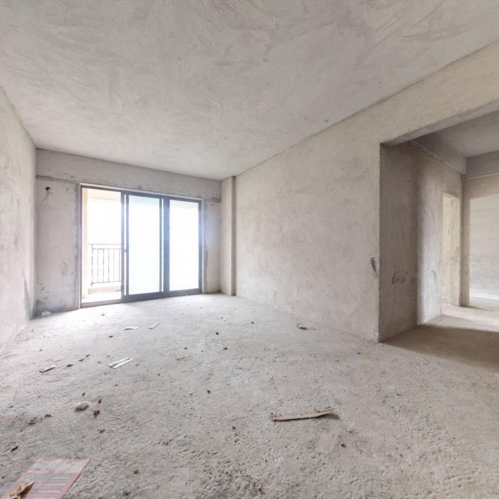
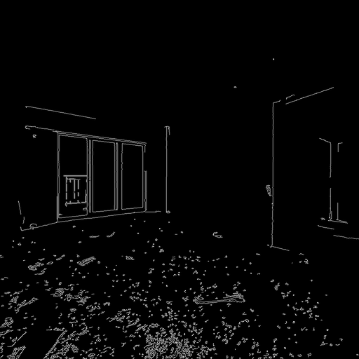

# MMagic——AIG-Interior-Design

# 环境配置

https://mmagic.readthedocs.io/en/latest/get_started/install.html

```shell
conda create -n mmagic python=3.8 -y

conda activate mmagic

git clone git@github.com:open-mmlab/mmagic.git

cd mmagic

# conda config --add channels conda-forge
conda config --add channels https://mirrors.tuna.tsinghua.edu.cn/anaconda/pkgs/main
conda config --add channels https://mirrors.tuna.tsinghua.edu.cn/anaconda/pkgs/free
conda config --add channels https://mirrors.tuna.tsinghua.edu.cn/anaconda/pkgs/r
conda config --add channels https://mirrors.tuna.tsinghua.edu.cn/anaconda/pkgs/pro
conda config --add channels https://mirrors.tuna.tsinghua.edu.cn/anaconda/pkgs/msys2

# conda install mamba -y

conda install pytorch torchvision -c pytorch -y
# conda install pytorch==1.12.1 torchvision==0.13.1 torchaudio==0.12.1 cudatoolkit=11.3 -c pytorch -y

pip install -U openmim

mim install 'mmcv>=2.0.0'

pip install -U "mmengine>=0.7.1, <1.0.0" -i https://pypi.tuna.tsinghua.edu.cn/simple

mim install -e . -y

pip install accelerate
```

## 安装验证

```shell
python demo/mmagic_inference_demo.py \
    --model-name stable_diffusion \
    --text "A panda is having dinner at KFC" \
    --result-out-dir ./output/sd_res.png
```

运行后会开始下载模型

```shell
Downloading (…)on_pytorch_model.bin:   7%|███████▌                                                                                               | 252M/3.44G [01:29<12:53, 4.12MB/s]
```

如果未安装`accelerate`，则会出现以下提示（但仍会下载模型）

~~~shell
Cannot initialize model with low cpu memory usage because `accelerate` was not found in the environment. Defaulting to `low_cpu_mem_usage=False`. It is strongly recommended to install `accelerate` for faster and less memory-intense model loading. You can do so with: 
```
pip install accelerate
```
~~~

下载完成后，在当前目录生成`/output/sd_res.png`：

> "A panda is having dinner at KFC"


### 安装成功！

# 数据集准备

## 通过Canny边缘检测图+prompt生成新图

https://github.com/open-mmlab/mmagic/blob/main/configs/controlnet/README.md

参考controlnet的README文档

> ```python
> import cv2
> import numpy as np
> import mmcv
> from mmengine import Config
> from PIL import Image
> 
> from mmagic.registry import MODELS
> from mmagic.utils import register_all_modules
> 
> register_all_modules()
> 
> cfg = Config.fromfile('configs/controlnet/controlnet-canny.py')
> controlnet = MODELS.build(cfg.model).cuda()
> 
> prompt = 'Room with blue walls and a yellow ceiling.'
> control_url = 'https://user-images.githubusercontent.com/28132635/230288866-99603172-04cb-47b3-8adb-d1aa532d1d2c.jpg'
> control_img = mmcv.imread(control_url)
> control = cv2.Canny(control_img, 100, 200)
> control = control[:, :, None]
> control = np.concatenate([control] * 3, axis=2)
> control = Image.fromarray(control)
> 
> output_dict = controlnet.infer(prompt, control=control)
> samples = output_dict['samples']
> for idx, sample in enumerate(samples):
>     sample.save(f'sample_{idx}.png')
> controls = output_dict['controls']
> for idx, control in enumerate(controls):
>     control.save(f'control_{idx}.png')
> ```

### 代码分析 by：GPT-3.5

> 当然，我很乐意为您解析这段代码。下面是代码的分块解释：
>
> ```python
> import cv2
> import numpy as np
> import mmcv
> from mmengine import Config
> from PIL import Image
> 
> from mmagic.registry import MODELS
> from mmagic.utils import register_all_modules
> 
> register_all_modules()
> ```
>
> 这部分代码是导入所需的库和模块。`cv2` 是 OpenCV 库，用于图像处理。`numpy` 是一个用于科学计算的库。`mmcv` 是一个基于 OpenCV 的计算机视觉库。`Config` 是一个用于加载配置文件的类。`Image` 是 PIL 库中的一个类，用于图像处理。`MODELS` 是从 `mmagic.registry` 中导入的模型注册表。`register_all_modules()` 函数用于注册所有模块。
>
> ```python
> cfg = Config.fromfile('configs/controlnet/controlnet-canny.py')
> controlnet = MODELS.build(cfg.model).cuda()
> ```
>
> 这部分代码加载了配置文件 `'configs/controlnet/controlnet-canny.py'` 并创建了一个配置对象 `cfg`。然后，使用配置对象构建了一个模型 `controlnet`，该模型由 `MODELS.build()` 函数根据配置构建，并使用 CUDA 加速。
>
> ```python
> prompt = 'Room with blue walls and a yellow ceiling.'
> control_url = 'https://user-images.githubusercontent.com/28132635/230288866-99603172-04cb-47b3-8adb-d1aa532d1d2c.jpg'
> control_img = mmcv.imread(control_url)
> control = cv2.Canny(control_img, 100, 200)
> control = control[:, :, None]
> control = np.concatenate([control] * 3, axis=2)
> control = Image.fromarray(control)
> ```
>
> 这部分代码定义了一个字符串变量 `prompt`，其中包含描述图像的文本。`control_url` 是一个包含控制图像的 URL。`mmcv.imread()` 函数用于从 URL 中读取图像并将其存储在 `control_img` 变量中。然后，使用 `cv2.Canny()` 函数对 `control_img` 进行边缘检测，生成边缘图像 `control`。接下来的几行代码将 `control` 转换为彩色图像格式，并使用 PIL 的 `Image.fromarray()` 函数将其转换为 PIL 图像对象。
>
> ```python
> output_dict = controlnet.infer(prompt, control=control)
> samples = output_dict['samples']
> for idx, sample in enumerate(samples):
>     sample.save(f'sample_{idx}.png')
> controls = output_dict['controls']
> for idx, control in enumerate(controls):
>     control.save(f'control_{idx}.png')
> ```
>
> 这部分代码使用 `controlnet` 模型对给定的 `prompt` 和 `control` 进行推理。推理结果存储在 `output_dict` 字典中。`samples` 是生成的图像样本列表，通过迭代列表中的每个样本，并使用 `sample.save()` 将其保存为 PNG 图像文件。类似地，`controls` 是控制图像列表，将每个控制图像保存为 PNG 文件。
>
> 以上是对代码的
>
> 分块解释。如有需要，请随时提问。

### 自定义生成结果

使用如下代码

```python
import cv2
import numpy as np
import mmcv
from mmengine import Config
from PIL import Image

from mmagic.registry import MODELS
from mmagic.utils import register_all_modules

register_all_modules()

cfg = Config.fromfile('/root/autodl-tmp/work/mmagic-main/configs/controlnet/controlnet-canny.py')
controlnet = MODELS.build(cfg.model).cuda()

prompt = 'A spacious room with blue walls and a vibrant yellow ceiling. The walls are painted in a calming shade of blue, creating a soothing atmosphere. The ceiling features a bold yellow color, adding a touch of energy and warmth to the space. The room is well-lit with large windows, allowing plenty of natural light to fill the room. It is furnished with comfortable seating and tasteful decor, creating an inviting and stylish ambiance. The combination of blue walls and a yellow ceiling creates a harmonious and visually striking color scheme. Overall, it is a delightful room that combines relaxation and vibrancy.'
control_url = '/root/autodl-tmp/data/Rough_housing.jpg'
control_img = mmcv.imread(control_url)
control = cv2.Canny(control_img, 100, 200)
control = control[:, :, None]
control = np.concatenate([control] * 3, axis=2)
control = Image.fromarray(control)

output_dict = controlnet.infer(prompt, control=control)
samples = output_dict['samples']
for idx, sample in enumerate(samples):
    sample.save(f'sample_{idx}.png')
controls = output_dict['controls']
for idx, control in enumerate(controls):
    control.save(f'control_{idx}.png')
```

第一次运行还是需要下载模型

```shell
Downloading (…)cheduler_config.json: 100%|██████████████████████████████████████████████████████████████████████████████████████████████████████████| 308/308 [00:00<00:00, 52.4kB/s]
06/16 01:04:18 - mmengine - INFO - Creating runwayml/stable-diffusion-v1-5 by 'HuggingFace'
/root/autodl-tmp/work/mmagic-main/mmagic/models/archs/wrapper.py:149: FutureWarning: Accessing config attribute `block_out_channels` directly via 'AutoencoderKL' object attribute is deprecated. Please access 'block_out_channels' over 'AutoencoderKL's config object instead, e.g. 'unet.config.block_out_channels'.
  return getattr(self.model, name)
Do not support Xformers. Please install Xformers first. The program will run without Xformers.
Downloading (…)lve/main/config.json: 100%|███████████████████████████████████████████████████████████████████████████████████████████████████████████| 920/920 [00:00<00:00, 567kB/s]
Downloading (…)on_pytorch_model.bin:   2%|██▏                                                                                                    | 31.5M/1.45G [00:59<45:57, 513kB/s]
```

下载完成后，运行完毕，出图






# 海报 by：designer.microsoft

https://designer.microsoft.com/


尺寸：1920*1080

prompt：

> A poster on interior design

# 踩坑

## 1 OSError

训练时遇到以下问题（运行controlnet或验证安装时都有可能发生）

```python
╭─────────────────────────────── Traceback (most recent call last) ────────────────────────────────╮
│ /root/miniconda3/envs/mmagic/lib/python3.8/site-packages/urllib3/response.py:444 in              │
│ _error_catcher                                                                                   │
│                                                                                                  │
│   441 │   │                                                                                      │
│   442 │   │   try:                                                                               │
│   443 │   │   │   try:                                                                           │
│ ❱ 444 │   │   │   │   yield                                                                      │
│   445 │   │   │                                                                                  │
│   446 │   │   │   except SocketTimeout:                                                          │
│   447 │   │   │   │   # FIXME: Ideally we'd like to include the url in the ReadTimeoutError bu   │
│                                                                                                  │
│ /root/miniconda3/envs/mmagic/lib/python3.8/site-packages/urllib3/response.py:567 in read         │
│                                                                                                  │
│   564 │   │   fp_closed = getattr(self._fp, "closed", False)                                     │
│   565 │   │                                                                                      │
│   566 │   │   with self._error_catcher():                                                        │
│ ❱ 567 │   │   │   data = self._fp_read(amt) if not fp_closed else b""                            │
│   568 │   │   │   if amt is None:                                                                │
│   569 │   │   │   │   flush_decoder = True                                                       │
│   570 │   │   │   else:                                                                          │
│                                                                                                  │
│ /root/miniconda3/envs/mmagic/lib/python3.8/site-packages/urllib3/response.py:525 in _fp_read     │
│                                                                                                  │
│   522 │   │   │   │   │   amt -= chunk_amt                                                       │
│   523 │   │   │   │   else:                                                                      │
│   524 │   │   │   │   │   chunk_amt = max_chunk_amt                                              │
│ ❱ 525 │   │   │   │   data = self._fp.read(chunk_amt)                                            │
│   526 │   │   │   │   if not data:                                                               │
│   527 │   │   │   │   │   break                                                                  │
│   528 │   │   │   │   buffer.write(data)                                                         │
│                                                                                                  │
│ /root/miniconda3/envs/mmagic/lib/python3.8/http/client.py:459 in read                            │
│                                                                                                  │
│    456 │   │   if amt is not None:                                                               │
│    457 │   │   │   # Amount is given, implement using readinto                                   │
│    458 │   │   │   b = bytearray(amt)                                                            │
│ ❱  459 │   │   │   n = self.readinto(b)                                                          │
│    460 │   │   │   return memoryview(b)[:n].tobytes()                                            │
│    461 │   │   else:                                                                             │
│    462 │   │   │   # Amount is not given (unbounded read) so we must check self.length           │
│                                                                                                  │
│ /root/miniconda3/envs/mmagic/lib/python3.8/http/client.py:503 in readinto                        │
│                                                                                                  │
│    500 │   │   # we do not use _safe_read() here because this may be a .will_close               │
│    501 │   │   # connection, and the user is reading more bytes than will be provided            │
│    502 │   │   # (for example, reading in 1k chunks)                                             │
│ ❱  503 │   │   n = self.fp.readinto(b)                                                           │
│    504 │   │   if not n and b:                                                                   │
│    505 │   │   │   # Ideally, we would raise IncompleteRead if the content-length                │
│    506 │   │   │   # wasn't satisfied, but it might break compatibility.                         │
│                                                                                                  │
│ /root/miniconda3/envs/mmagic/lib/python3.8/socket.py:669 in readinto                             │
│                                                                                                  │
│   666 │   │   │   raise OSError("cannot read from timed out object")                             │
│   667 │   │   while True:                                                                        │
│   668 │   │   │   try:                                                                           │
│ ❱ 669 │   │   │   │   return self._sock.recv_into(b)                                             │
│   670 │   │   │   except timeout:                                                                │
│   671 │   │   │   │   self._timeout_occurred = True                                              │
│   672 │   │   │   │   raise                                                                      │
│                                                                                                  │
│ /root/miniconda3/envs/mmagic/lib/python3.8/ssl.py:1241 in recv_into                              │
│                                                                                                  │
│   1238 │   │   │   │   raise ValueError(                                                         │
│   1239 │   │   │   │     "non-zero flags not allowed in calls to recv_into() on %s" %            │
│   1240 │   │   │   │     self.__class__)                                                         │
│ ❱ 1241 │   │   │   return self.read(nbytes, buffer)                                              │
│   1242 │   │   else:                                                                             │
│   1243 │   │   │   return super().recv_into(buffer, nbytes, flags)                               │
│   1244                                                                                           │
│                                                                                                  │
│ /root/miniconda3/envs/mmagic/lib/python3.8/ssl.py:1099 in read                                   │
│                                                                                                  │
│   1096 │   │   │   raise ValueError("Read on closed or unwrapped SSL socket.")                   │
│   1097 │   │   try:                                                                              │
│   1098 │   │   │   if buffer is not None:                                                        │
│ ❱ 1099 │   │   │   │   return self._sslobj.read(len, buffer)                                     │
│   1100 │   │   │   else:                                                                         │
│   1101 │   │   │   │   return self._sslobj.read(len)                                             │
│   1102 │   │   except SSLError as x:                                                             │
╰──────────────────────────────────────────────────────────────────────────────────────────────────╯
timeout: The read operation timed out
......
```

### 原因

原因推测是mmagic会调用huggingface进行下载，但由于网络问题，下载不稳定，一旦下载失败就会出现如上报错

