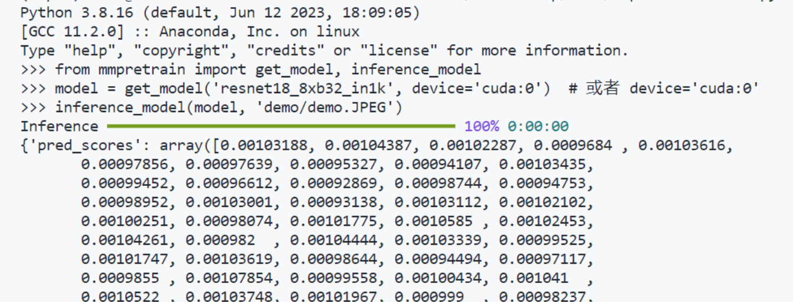
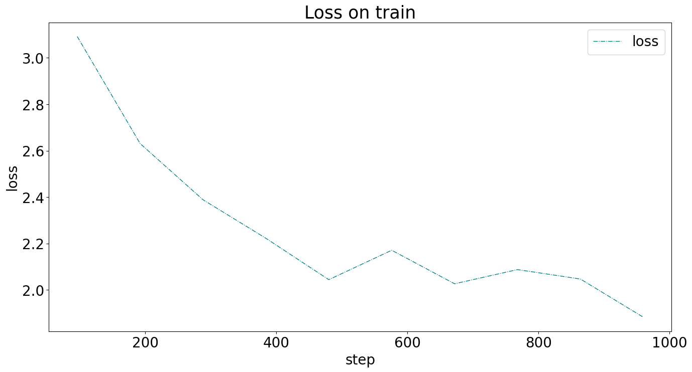
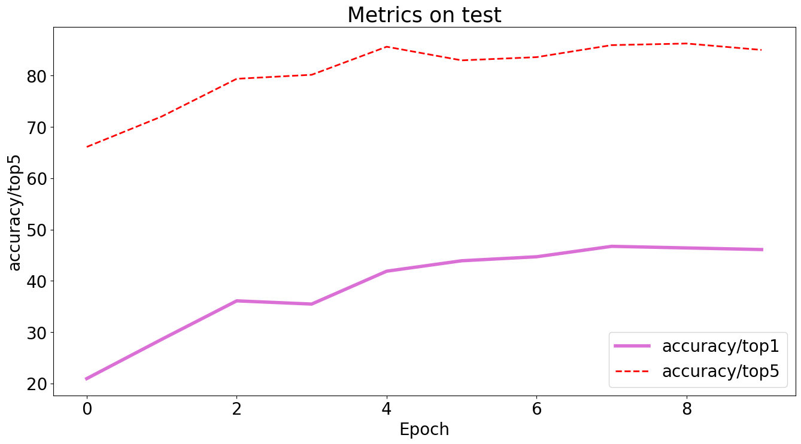
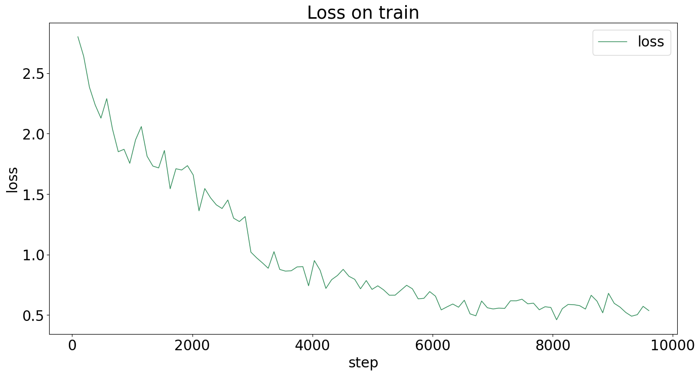
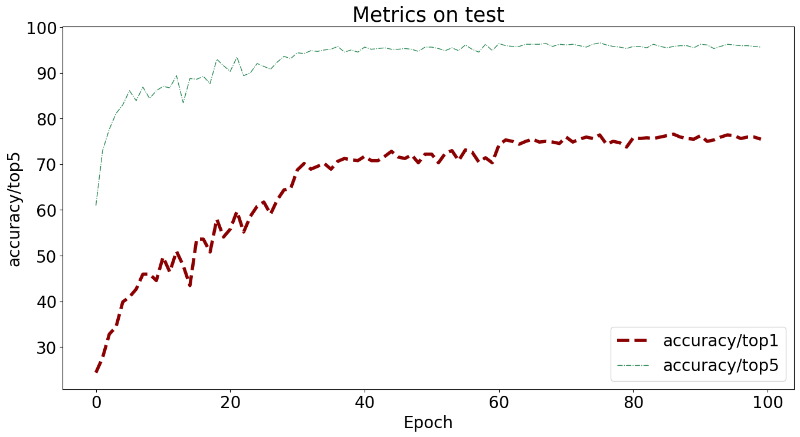
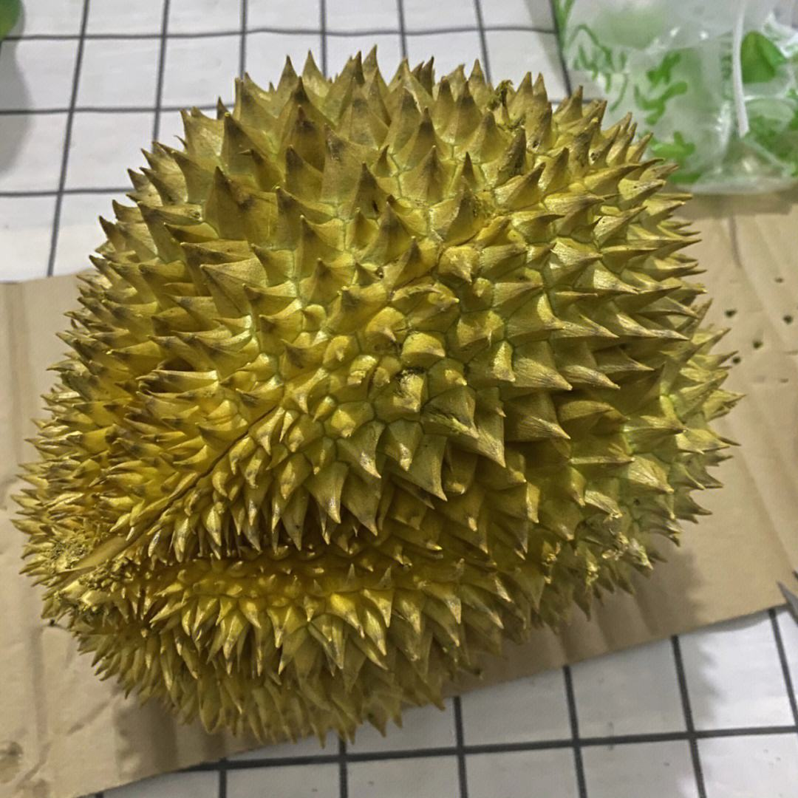
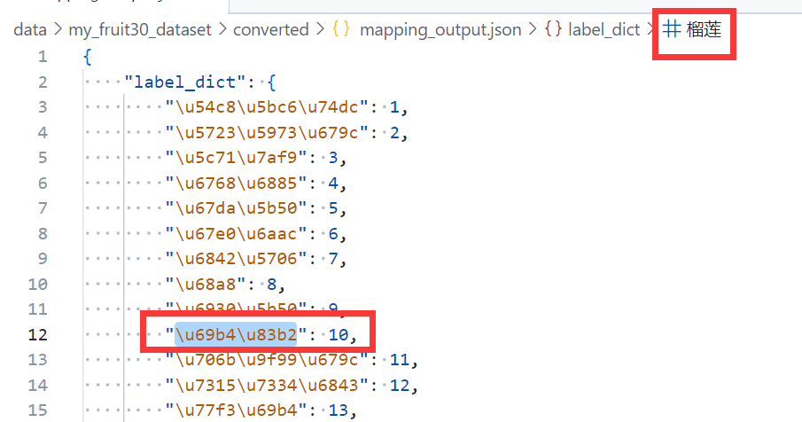

# MMPretrain——Fruit Classification

# 环境配置

https://mmpretrain.readthedocs.io/zh_CN/latest/get_started.html

```shell
conda create -n mmpre python=3.8 -y

conda activate mmpre

git clone https://github.com/open-mmlab/mmpretrain.git

cd mmpretrain

# conda config --add channels conda-forge
conda config --add channels https://mirrors.tuna.tsinghua.edu.cn/anaconda/pkgs/main
conda config --add channels https://mirrors.tuna.tsinghua.edu.cn/anaconda/pkgs/free
conda config --add channels https://mirrors.tuna.tsinghua.edu.cn/anaconda/pkgs/r
conda config --add channels https://mirrors.tuna.tsinghua.edu.cn/anaconda/pkgs/pro
conda config --add channels https://mirrors.tuna.tsinghua.edu.cn/anaconda/pkgs/msys2

# conda install mamba -y

conda install pytorch torchvision -c pytorch -y
# conda install pytorch==1.12.1 torchvision==0.13.1 torchaudio==0.12.1 cudatoolkit=11.3 -c pytorch -y

pip install -U openmim

pip install -U "mmengine>=0.7.1, <1.0.0" -i https://pypi.tuna.tsinghua.edu.cn/simple

mim install -e . -y

mim install -e ".[multimodal]" -y
```

## 安装验证

```shell
python3
```

```python
from mmpretrain import get_model, inference_model

model = get_model('resnet18_8xb32_in1k', device='cuda:0')  # 或者 device='cuda:0'
inference_model(model, 'demo/demo.JPEG')
```

在python中运行上方代码无提示，返回结果如下：



### 安装成功！

# 数据集准备

https://mmpretrain.readthedocs.io/zh_CN/latest/user_guides/dataset_prepare.html

## 处理脚本

### `generate_dataset.py`

脚本程序——读取原始数据集并按比例划分训练集、验证集、测试集，生成相应标注文件

### `generate_dataset_interface.py`

脚本接口程序——设置参数，调用`generate_dataset.py`

### `convert_labels.py`

脚本程序——读取一个或多个标注文件，生成相应的转换文件（标签映射为数字）与映射字典

### `convert_labels_interface.py`

脚本接口程序——设置参数，调用`convert_labels.py`

### 结构

```shell
# 原始数据集
.
├── 哈密瓜
├── 圣女果
├── 山竹
├── 杨梅
├── 柚子
├── 柠檬
├── 桂圆
├── 梨
├── 椰子
├── 榴莲
├── 火龙果
├── 猕猴桃
├── 石榴
├── 砂糖橘
├── 胡萝卜
├── 脐橙
├── 芒果
├── 苦瓜
├── 苹果-红
├── 苹果-青
├── 草莓
├── 荔枝
├── 菠萝
├── 葡萄-白
├── 葡萄-红
├── 西瓜
├── 西红柿
├── 车厘子
├── 香蕉
└── 黄瓜
```

```shell
# 生成数据集
.
├── test
├── test.txt
├── train
├── train.txt
├── val
└── val.txt

# converted文件夹
.
├── converted_test.txt
├── converted_train.txt
├── converted_val.txt
└── mapping_val.txt.json
```

```shell
# 脚本
.
├── convert_labels_interface.py
├── convert_labels.py
├── generate_dataset_interface.py
└── generate_dataset.py
```

# 配置Config（以resnet50_8xb32_in1k为例）

## 生成config

通过`cd`命令切换到工作目录，运行以下命令：

```shell
python3 /root/autodl-tmp/work/mmpretrain-main/tools/train.py \
/root/autodl-tmp/work/mmpretrain-main/configs/resnet/resnet50_8xb32_in1k.py
```

会报错（如果不在mmpretrain目录中），但是会生成以下工作文件：

```shell
.
└── work_dirs
    └── resnet50_8xb32_in1k
        ├── <work_datetime>
        │   ├── <work_datetime>.log
        │   └── vis_data
        │       └── config.py
        └── resnet50_8xb32_in1k.py
```

其中`<work_datetime>`是当前时间。

注意到，其中包括了`resnet50_8xb32_in1k.py`，这是一份原始的config文件，接下来我们在这份文件的基础上进行config配置。

## 自定义config

```python
model = dict(
    type='ImageClassifier',
    backbone=dict(
        type='ResNet',
        depth=50,
        num_stages=4,
        out_indices=(3, ),
        style='pytorch'),
    neck=dict(type='GlobalAveragePooling'),
    head=dict(
        type='LinearClsHead',
        num_classes=1000,
        in_channels=2048,
        loss=dict(type='CrossEntropyLoss', loss_weight=1.0),
        topk=(1, 5)))
dataset_type = 'CustomDataset'
data_preprocessor = dict(
    num_classes=30,
    mean=[123.675, 116.28, 103.53],
    std=[58.395, 57.12, 57.375],
    to_rgb=True)
train_pipeline = [
    dict(type='LoadImageFromFile'),
    dict(type='RandomResizedCrop', scale=224),
    dict(type='RandomFlip', prob=0.5, direction='horizontal'),
    dict(type='PackInputs')
]
test_pipeline = [
    dict(type='LoadImageFromFile'),
    dict(type='ResizeEdge', scale=256, edge='short'),
    dict(type='CenterCrop', crop_size=224),
    dict(type='PackInputs')
]
train_dataloader = dict(
    pin_memory=True,
    persistent_workers=True,
    collate_fn=dict(type='default_collate'),
    batch_size=32,
    num_workers=5,
    dataset=dict(
        type=dataset_type,
        data_root='/root/autodl-tmp/data/my_fruit30_dataset',
        ann_file='/root/autodl-tmp/data/my_fruit30_dataset/train.txt',
        data_prefix='train',
        pipeline=[
            dict(type='LoadImageFromFile'),
            dict(type='RandomResizedCrop', scale=224),
            dict(type='RandomFlip', prob=0.5, direction='horizontal'),
            dict(type='PackInputs')
        ]),
    sampler=dict(type='DefaultSampler', shuffle=True))
val_dataloader = dict(
    pin_memory=True,
    persistent_workers=True,
    collate_fn=dict(type='default_collate'),
    batch_size=32,
    num_workers=5,
    dataset=dict(
        type=dataset_type,
        data_root='/root/autodl-tmp/data/my_fruit30_dataset',
        ann_file='/root/autodl-tmp/data/my_fruit30_dataset/val.txt',
        data_prefix='val',
        pipeline=[
            dict(type='LoadImageFromFile'),
            dict(type='ResizeEdge', scale=256, edge='short'),
            dict(type='CenterCrop', crop_size=224),
            dict(type='PackInputs')
        ]),
    sampler=dict(type='DefaultSampler', shuffle=False))
val_evaluator = dict(type='Accuracy', topk=(1, 5))
test_dataloader = dict(
    pin_memory=True,
    persistent_workers=True,
    collate_fn=dict(type='default_collate'),
    batch_size=32,
    num_workers=5,
    dataset=dict(
        type=dataset_type,
        data_root='/root/autodl-tmp/data/my_fruit30_dataset',
        ann_file='/root/autodl-tmp/data/my_fruit30_dataset/test.txt',
        data_prefix='test',
        pipeline=[
            dict(type='LoadImageFromFile'),
            dict(type='ResizeEdge', scale=256, edge='short'),
            dict(type='CenterCrop', crop_size=224),
            dict(type='PackInputs')
        ]),
    sampler=dict(type='DefaultSampler', shuffle=False))
test_evaluator = dict(type='Accuracy', topk=(1, 5))
optim_wrapper = dict(
    optimizer=dict(type='SGD', lr=0.08, momentum=0.9, weight_decay=0.0001))
param_scheduler = dict(
    type='MultiStepLR', by_epoch=True, milestones=[30, 60, 90], gamma=0.1)
train_cfg = dict(by_epoch=True, max_epochs=10, val_interval=1)
val_cfg = dict()
test_cfg = dict()
auto_scale_lr = dict(base_batch_size=256)
default_scope = 'mmpretrain'
default_hooks = dict(
    timer=dict(type='IterTimerHook'),
    logger=dict(type='LoggerHook', interval=100),
    param_scheduler=dict(type='ParamSchedulerHook'),
    checkpoint=dict(type='CheckpointHook', interval=10, save_best='auto'),
    sampler_seed=dict(type='DistSamplerSeedHook'),
    visualization=dict(type='VisualizationHook', enable=False))
env_cfg = dict(
    cudnn_benchmark=False,
    mp_cfg=dict(mp_start_method='fork', opencv_num_threads=0),
    dist_cfg=dict(backend='nccl'))
vis_backends = [dict(type='LocalVisBackend')]
visualizer = dict(
    type='UniversalVisualizer', vis_backends=[dict(type='LocalVisBackend')])
log_level = 'INFO'
load_from = None
resume = False
randomness = dict(seed=None, deterministic=False)
launcher = 'none'
work_dir = './work_dirs/resnet50_8xb32_in1k'

```

### 修改内容

- dataset_type
- dataloader（路径）
- lr（改为0.08）
- train_cfg（max_epochs改为10）
- default_hooks（checkpoint保存间隔改为10，增加save_best='auto'）

## 模型训练

```shell
python3 \
/root/autodl-tmp/work/mmpretrain-main/tools/train.py \
/root/autodl-tmp/work/experiment/resnet50_8xb32_in1k.py \
> output.log 2>&1
```

## 训练结果（epoch10）（best acc/top1 46.71875）





## 训练结果（epoch100）（best acc/top1 76.5625）





## 推理验证（e10）

```shell
python3 \
/root/autodl-tmp/work/mmpretrain-main/demo/image_demo.py \
/root/autodl-tmp/data/my_fruit30_dataset/liulian.jpeg \
/root/autodl-tmp/work/experiment/resnet50_8xb32_in1k.py \
--checkpoint /root/autodl-tmp/work/experiment/work_dirs/resnet50_8xb32_in1k/best_accuracy_top1_epoch_8.pth \
--device "cuda:0"
```

```shell
Loads checkpoint by local backend from path: /root/autodl-tmp/work/experiment/work_dirs/resnet50_8xb32_in1k/best_accuracy_top1_epoch_8.pth
Inference ━━━━━━━━━━━━━━━━━━━━━━━━━━━━━━━━━━━━━━━━ 100% 0:00:00
{
  "pred_label": 10,
  "pred_score": 0.7012592554092407
}
```





### 推理成功！（score：0.7012592554092407）

### 推理验证（e100）（score：0.9974114298820496）

```shell
python3 \
/root/autodl-tmp/work/mmpretrain-main/demo/image_demo.py \
/root/autodl-tmp/data/my_fruit30_dataset/liulian.jpeg \
/root/autodl-tmp/work/experiment/resnet50_8xb32_in1k.py \
--checkpoint /root/autodl-tmp/work/experiment/work_dirs/resnet50_8xb32_in1k/best_accuracy_top1_epoch_87.pth \
--device "cuda:0"
```

```shell
Loads checkpoint by local backend from path: /root/autodl-tmp/work/experiment/work_dirs/resnet50_8xb32_in1k/best_accuracy_top1_epoch_87.pth
Inference ━━━━━━━━━━━━━━━━━━━━━━━━━━━━━━━━━━━━━━━━ 100% 0:00:00
{
  "pred_label": 10,
  "pred_score": 0.9974114298820496
}
```

