# MMDetection——Balloon Detection

# 环境配置

https://mmdetection.readthedocs.io/en/latest/

```shell
conda create -n mmdet python=3.8 -y

conda activate mmdet

git clone https://github.com/open-mmlab/mmdetection.git

cd mmdetection

# conda config --add channels conda-forge
conda config --add channels https://mirrors.tuna.tsinghua.edu.cn/anaconda/pkgs/main
conda config --add channels https://mirrors.tuna.tsinghua.edu.cn/anaconda/pkgs/free
conda config --add channels https://mirrors.tuna.tsinghua.edu.cn/anaconda/pkgs/r
conda config --add channels https://mirrors.tuna.tsinghua.edu.cn/anaconda/pkgs/pro
conda config --add channels https://mirrors.tuna.tsinghua.edu.cn/anaconda/pkgs/msys2

# conda install mamba -y

conda install pytorch torchvision -c pytorch -y
# conda install pytorch==1.12.1 torchvision==0.13.1 torchaudio==0.12.1 cudatoolkit=11.3 -c pytorch -y

pip install -U openmim

pip install -U "mmengine>=0.7.1, <1.0.0" -i https://pypi.tuna.tsinghua.edu.cn/simple

mim install -e . -y
```

## 安装验证

```shell
mim download mmdet --config rtmdet_tiny_8xb32-300e_coco --dest .
```

```shell
python demo/image_demo.py demo/demo.jpg rtmdet_tiny_8xb32-300e_coco.py --weights rtmdet_tiny_8xb32-300e_coco_20220902_112414-78e30dcc.pth --device cuda:0
```

在当前目录生成outputs文件夹：

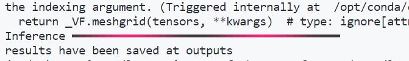

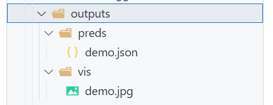

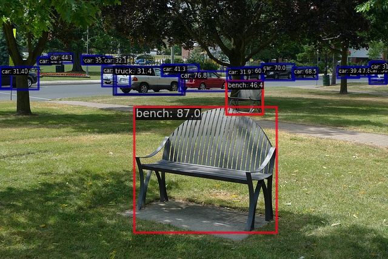

### 安装成功！

# 数据集准备

https://mmdetection.readthedocs.io/zh_CN/latest/user_guides/dataset_prepare.html

## 处理脚本

参考：https://mmdetection.readthedocs.io/zh_CN/latest/user_guides/train.html#id7

### `ballon2coco.py`

脚本程序——读取气球数据集，转换成coco标注格式

### `ballon2coco_interface.py`

脚本接口程序——设置参数，调用`ballon2coco.py`

## 结构

```shell
# 原始数据集
.
├── train # 内含.txt(annotation)
└── val # 内含.txt(annotation)
```

```shell
# 生成coco格式annotation
.
├── coco_train.json
└── coco_val.json
```

```shell
# 脚本
.
├── ballon2coco_interface.py
└── ballon2coco.py
```

# 配置Config（以rtmdet_tiny_8xb32-300e_coco为例）

## 获得config

在安装验证的过程中，我们已经下载了`rtmdet_tiny_8xb32-300e_coco.py`

> ```shell
> mim download mmdet --config rtmdet_tiny_8xb32-300e_coco --dest .
> ```

## 自定义config

数据集自定义参考：https://mmdetection.readthedocs.io/zh_CN/latest/user_guides/train.html#id7

使用config继承，来减少修改负担

> ```python
> _base_ = './rtmdet_tiny_8xb32-300e_coco.py'
> ```

新建`my_rtmdet_tiny_8xb32-300e_coco.py`，结构：

```shell
.
├── my_rtmdet_tiny_8xb32-300e_coco.py
└── rtmdet_tiny_8xb32-300e_coco.py
```

### `my_rtmdet_tiny_8xb32-300e_coco.py`

```python
_base_ = './rtmdet_tiny_8xb32-300e_coco.py'

# ！！！修改数据集，否则报错，参考https://github.com/open-mmlab/mmdetection/issues/9610
metainfo = {
    'classes': ('balloon',),
    'palette': [
        (220, 20, 60),
    ]
}

model = dict(
    type='RTMDet',
    data_preprocessor=dict(
        type='DetDataPreprocessor',
        mean=[103.53, 116.28, 123.675],
        std=[57.375, 57.12, 58.395],
        bgr_to_rgb=False,
        batch_augments=None),
    backbone=dict(
        type='CSPNeXt',
        arch='P5',
        expand_ratio=0.5,
        deepen_factor=0.167,
        widen_factor=0.375,
        channel_attention=True,
        norm_cfg=dict(type='SyncBN'),
        act_cfg=dict(type='SiLU', inplace=True),
        init_cfg=dict(
            type='Pretrained',
            prefix='backbone.',
            checkpoint=
            'https://download.openmmlab.com/mmdetection/v3.0/rtmdet/cspnext_rsb_pretrain/cspnext-tiny_imagenet_600e.pth'
        )),
    neck=dict(
        type='CSPNeXtPAFPN',
        in_channels=[96, 192, 384],
        out_channels=96,
        num_csp_blocks=1,
        expand_ratio=0.5,
        norm_cfg=dict(type='SyncBN'),
        act_cfg=dict(type='SiLU', inplace=True)),
    bbox_head=dict(
        type='RTMDetSepBNHead',
        num_classes=1,
        in_channels=96,
        stacked_convs=2,
        feat_channels=96,
        anchor_generator=dict(
            type='MlvlPointGenerator', offset=0, strides=[8, 16, 32]),
        bbox_coder=dict(type='DistancePointBBoxCoder'),
        loss_cls=dict(
            type='QualityFocalLoss',
            use_sigmoid=True,
            beta=2.0,
            loss_weight=1.0),
        loss_bbox=dict(type='GIoULoss', loss_weight=2.0),
        with_objectness=False,
        exp_on_reg=False,
        share_conv=True,
        pred_kernel_size=1,
        norm_cfg=dict(type='SyncBN'),
        act_cfg=dict(type='SiLU', inplace=True)),
    train_cfg=dict(
        assigner=dict(type='DynamicSoftLabelAssigner', topk=13),
        allowed_border=-1,
        pos_weight=-1,
        debug=False),
    test_cfg=dict(
        nms_pre=30000,
        min_bbox_size=0,
        score_thr=0.001,
        nms=dict(type='nms', iou_threshold=0.65),
        max_per_img=300))

default_hooks = dict(
    timer=dict(type='IterTimerHook'),
    logger=dict(type='LoggerHook', interval=50),
    param_scheduler=dict(type='ParamSchedulerHook'),
    checkpoint=dict(type='CheckpointHook', interval=25, max_keep_ckpts=3, save_best='auto'),
    sampler_seed=dict(type='DistSamplerSeedHook'),
    visualization=dict(type='DetVisualizationHook'))

optim_wrapper = dict(
    type='OptimWrapper',
    optimizer=dict(type='AdamW', lr=0.0032, weight_decay=0.05),
    paramwise_cfg=dict(
        norm_decay_mult=0, bias_decay_mult=0, bypass_duplicate=True))

data_root = '/root/autodl-tmp/data/balloon_dataset/balloon'
train_dataloader = dict(
    batch_size=32,
    num_workers=10,
    persistent_workers=True,
    sampler=dict(type='DefaultSampler', shuffle=True),
    batch_sampler=None,
    dataset=dict(
        metainfo=metainfo,
        data_root=data_root,
        ann_file='/root/autodl-tmp/data/balloon_dataset/balloon/coco_train.json',
        data_prefix=dict(img='train/'),
        filter_cfg=dict(filter_empty_gt=True, min_size=32),
        pipeline=[
            dict(type='LoadImageFromFile', backend_args=None),
            dict(type='LoadAnnotations', with_bbox=True),
            dict(
                type='CachedMosaic',
                img_scale=(640, 640),
                pad_val=114.0,
                max_cached_images=20,
                random_pop=False),
            dict(
                type='RandomResize',
                scale=(1280, 1280),
                ratio_range=(0.5, 2.0),
                keep_ratio=True),
            dict(type='RandomCrop', crop_size=(640, 640)),
            dict(type='YOLOXHSVRandomAug'),
            dict(type='RandomFlip', prob=0.5),
            dict(
                type='Pad', size=(640, 640),
                pad_val=dict(img=(114, 114, 114))),
            dict(
                type='CachedMixUp',
                img_scale=(640, 640),
                ratio_range=(1.0, 1.0),
                max_cached_images=10,
                random_pop=False,
                pad_val=(114, 114, 114),
                prob=0.5),
            dict(type='PackDetInputs')
        ],
        backend_args=None),
    pin_memory=True)
val_dataloader = dict(
    batch_size=5,
    num_workers=10,
    persistent_workers=True,
    drop_last=False,
    sampler=dict(type='DefaultSampler', shuffle=False),
    dataset=dict(
        metainfo=metainfo,
        data_root=data_root,
        ann_file='/root/autodl-tmp/data/balloon_dataset/balloon/coco_train.json',
        data_prefix=dict(img='train/'),
        test_mode=True,
        pipeline=[
            dict(type='LoadImageFromFile', backend_args=None),
            dict(type='Resize', scale=(640, 640), keep_ratio=True),
            dict(
                type='Pad', size=(640, 640),
                pad_val=dict(img=(114, 114, 114))),
            dict(
                type='PackDetInputs',
                meta_keys=('img_id', 'img_path', 'ori_shape', 'img_shape',
                           'scale_factor'))
        ],
        backend_args=None))
test_dataloader = dict(
    batch_size=5,
    num_workers=10,
    persistent_workers=True,
    drop_last=False,
    sampler=dict(type='DefaultSampler', shuffle=False),
    dataset=dict(
        metainfo=metainfo,
        data_root=data_root,
        ann_file='/root/autodl-tmp/data/balloon_dataset/balloon/coco_val.json',
        data_prefix=dict(img='val/'),
        test_mode=True,
        pipeline=[
            dict(type='LoadImageFromFile', backend_args=None),
            dict(type='Resize', scale=(640, 640), keep_ratio=True),
            dict(
                type='Pad', size=(640, 640),
                pad_val=dict(img=(114, 114, 114))),
            dict(
                type='PackDetInputs',
                meta_keys=('img_id', 'img_path', 'ori_shape', 'img_shape',
                           'scale_factor'))
        ],
        backend_args=None))
val_evaluator = dict(
    ann_file='/root/autodl-tmp/data/balloon_dataset/balloon/coco_train.json',
    )
test_evaluator = dict(
    ann_file='/root/autodl-tmp/data/balloon_dataset/balloon/coco_val.json',
    )

```

### 修改内容

- dataloader（路径）
- metainfo（替换dataset_type='Cocodataset'）
- model的head中的num_classes改为1（单独改num_classes并不起效，不知为何）
- lr（改为0.0032）
- default_hooks（checkpoint保存间隔改为25，增加save_best='auto'）

## 模型训练

```shell
python3 \
/root/autodl-tmp/work/mmdetection-main/tools/train.py \
/root/autodl-tmp/work/experiment/my_rtmdet_tiny_8xb32-300e_coco.py \
> output2.log 2>&1
```

## 训练结果（epoch300）

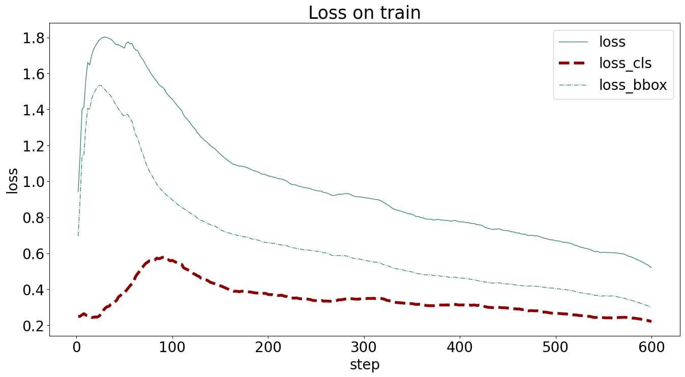

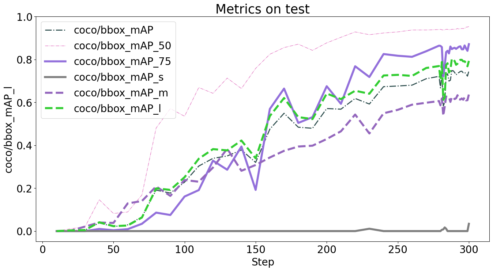

## 模型测试

```shell
python3 \
/root/autodl-tmp/work/mmdetection-main/tools/test.py \
/root/autodl-tmp/work/experiment/my_rtmdet_tiny_8xb32-300e_coco.py \
/root/autodl-tmp/work/experiment/work_dirs/my_rtmdet_tiny_8xb32-300e_coco/best_coco_bbox_mAP_epoch_292.pth \
> output2.log 2>&1
```

## 测试结果

>  Average Precision  (AP) @[ IoU=0.50:0.95 | area=  all | maxDets=100 ] = 0.477
>
>  Average Precision  (AP) @[ IoU=0.50    | area=  all | maxDets=100 ] = 0.667
>
>  Average Precision  (AP) @[ IoU=0.75    | area=  all | maxDets=100 ] = 0.551
>
>  Average Precision  (AP) @[ IoU=0.50:0.95 | area= small | maxDets=100 ] = 0.000
>
>  Average Precision  (AP) @[ IoU=0.50:0.95 | area=medium | maxDets=100 ] = 0.060
>
>  Average Precision  (AP) @[ IoU=0.50:0.95 | area= large | maxDets=100 ] = 0.634
>
>  Average Recall   (AR) @[ IoU=0.50:0.95 | area=  all | maxDets=  1 ] = 0.178
>
>  Average Recall   (AR) @[ IoU=0.50:0.95 | area=  all | maxDets= 10 ] = 0.522
>
>  Average Recall   (AR) @[ IoU=0.50:0.95 | area=  all | maxDets=100 ] = 0.570
>
>  Average Recall   (AR) @[ IoU=0.50:0.95 | area= small | maxDets=100 ] = 0.000
>
>  Average Recall   (AR) @[ IoU=0.50:0.95 | area=medium | maxDets=100 ] = 0.150
>
>  Average Recall   (AR) @[ IoU=0.50:0.95 | area= large | maxDets=100 ] = 0.742
>
> 06/14 19:52:16 - mmengine - INFO - bbox_mAP_copypaste: 0.477 0.667 0.551 0.000 0.060 0.634
>
> 06/14 19:52:16 - mmengine - INFO - Epoch(test) [3/3]   coco/bbox_mAP: 0.4770  coco/bbox_mAP_50: 0.6670  coco/bbox_mAP_75: 0.5510  coco/bbox_mAP_s: 0.0000  coco/bbox_mAP_m: 0.0600  coco/bbox_mAP_l: 0.6340  data_time: 0.4035  time: 1.2675

map=0.477，不理想

## 推理验证

```shell
python \
/root/autodl-tmp/work/mmdetection-main/demo/image_demo.py \
/root/autodl-tmp/data/ballon_child.jpg \
/root/autodl-tmp/work/experiment/my_rtmdet_tiny_8xb32-300e_coco.py \
--weights /root/autodl-tmp/work/experiment/work_dirs/my_rtmdet_tiny_8xb32-300e_coco/best_coco_bbox_mAP_epoch_292.pth \
--palette random \
--device cuda:0
```

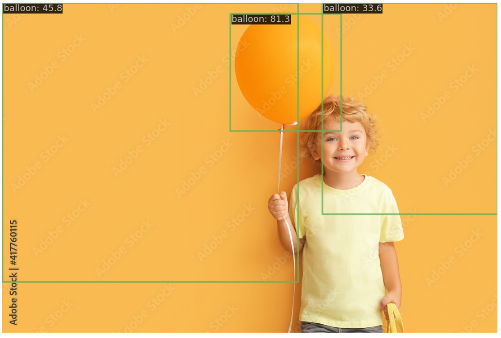

## 特征图

### 安装mmyolo

```shell
git clone https://github.com/open-mmlab/mmyolo.git
cd mmyolo
pip install -e .
```

### backbone特征图

```shell
python3 \
/root/autodl-tmp/work/mmyolo-main/demo/featmap_vis_demo.py \
/root/autodl-tmp/data/ballon_child.jpg \
/root/autodl-tmp/work/experiment/my_rtmdet_tiny_8xb32-300e_coco.py \
/root/autodl-tmp/work/experiment/work_dirs/my_rtmdet_tiny_8xb32-300e_coco/best_coco_bbox_mAP_epoch_292.pth \
--target-layers backbone  \
--channel-reduction squeeze_mean \
--device cuda:0
```

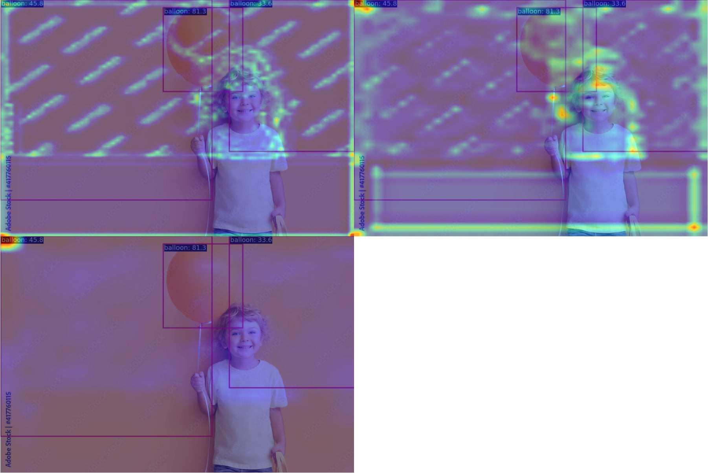

### neck特征图

```shell
python3 \
/root/autodl-tmp/work/mmyolo-main/demo/featmap_vis_demo.py \
/root/autodl-tmp/data/ballon_child.jpg \
/root/autodl-tmp/work/experiment/my_rtmdet_tiny_8xb32-300e_coco.py \
/root/autodl-tmp/work/experiment/work_dirs/my_rtmdet_tiny_8xb32-300e_coco/best_coco_bbox_mAP_epoch_292.pth \
--target-layers neck \
--channel-reduction squeeze_mean \
--device cuda:0
```

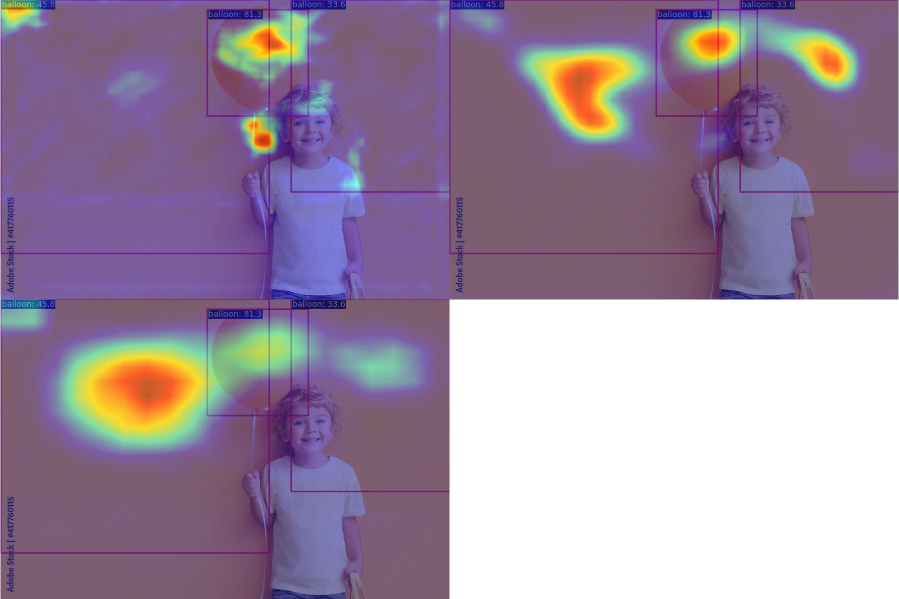

## Grad box AM

### 安装grad-cam

```shell
pip install grad-cam
```

### backbone特征图

```shell
python3 \
/root/autodl-tmp/work/mmyolo-main/demo/boxam_vis_demo.py \
/root/autodl-tmp/data/ballon_child.jpg \
/root/autodl-tmp/work/experiment/my_rtmdet_tiny_8xb32-300e_coco.py \
/root/autodl-tmp/work/experiment/work_dirs/my_rtmdet_tiny_8xb32-300e_coco/best_coco_bbox_mAP_epoch_292.pth \
--target-layers backbone.stage4  \
--device cuda:0
```

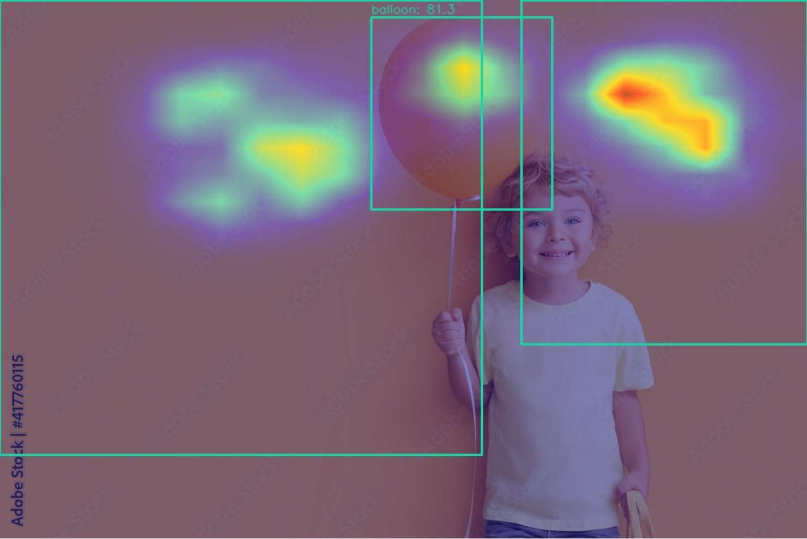

### neck特征图0

```shell
python3 \
/root/autodl-tmp/work/mmyolo-main/demo/boxam_vis_demo.py \
/root/autodl-tmp/data/ballon_child.jpg \
/root/autodl-tmp/work/experiment/my_rtmdet_tiny_8xb32-300e_coco.py \
/root/autodl-tmp/work/experiment/work_dirs/my_rtmdet_tiny_8xb32-300e_coco/best_coco_bbox_mAP_epoch_292.pth \
--target-layers neck.out_convs[0]  \
--device cuda:0
```

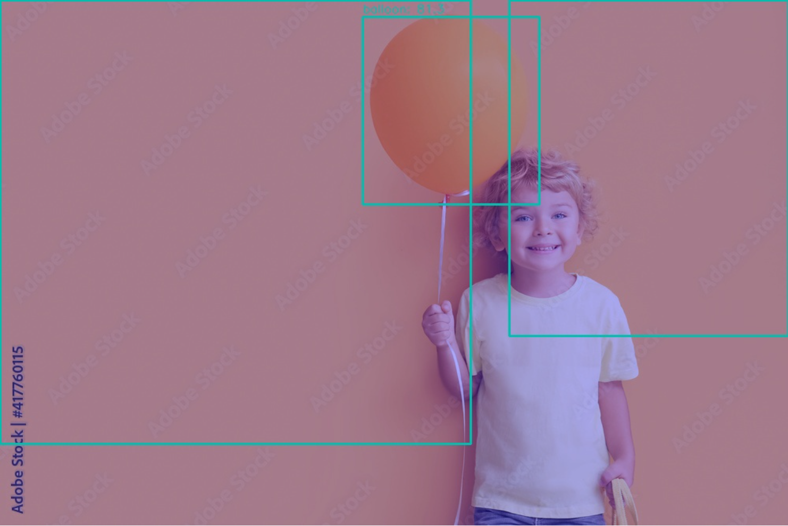

### neck特征图1

```shell
python3 \
/root/autodl-tmp/work/mmyolo-main/demo/boxam_vis_demo.py \
/root/autodl-tmp/data/ballon_child.jpg \
/root/autodl-tmp/work/experiment/my_rtmdet_tiny_8xb32-300e_coco.py \
/root/autodl-tmp/work/experiment/work_dirs/my_rtmdet_tiny_8xb32-300e_coco/best_coco_bbox_mAP_epoch_292.pth \
--target-layers neck.out_convs[1]  \
--device cuda:0
```

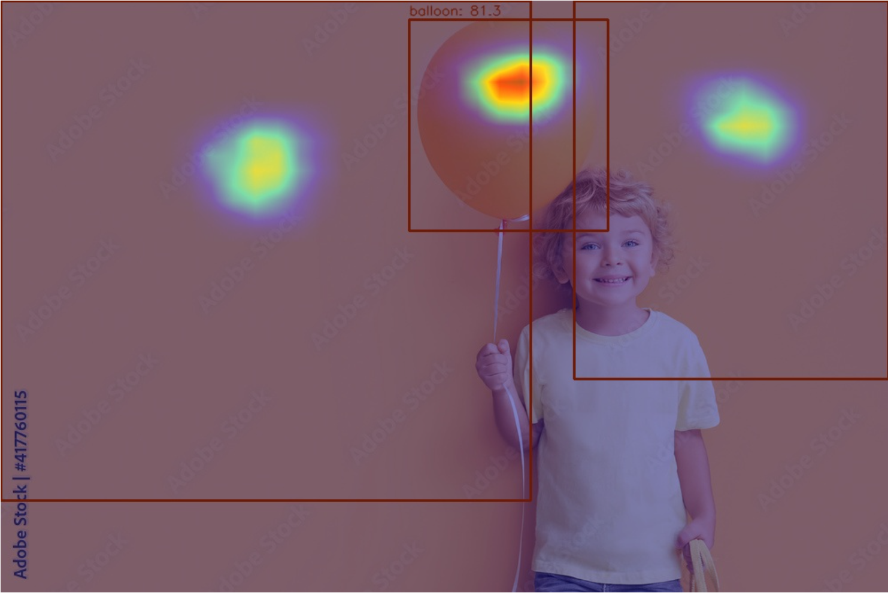

### neck特征图2

```shell
python3 \
/root/autodl-tmp/work/mmyolo-main/demo/boxam_vis_demo.py \
/root/autodl-tmp/data/ballon_child.jpg \
/root/autodl-tmp/work/experiment/my_rtmdet_tiny_8xb32-300e_coco.py \
/root/autodl-tmp/work/experiment/work_dirs/my_rtmdet_tiny_8xb32-300e_coco/best_coco_bbox_mAP_epoch_292.pth \
--target-layers neck.out_convs[2]  \
--device cuda:0
```


# 踩坑

## 1 num_classes

我在气球数据集上遇到了相同的问题，我在config中加入了以下代码却依然有这样的报错：

```python
metainfo = {
    'classes': ('balloon',),
    'palette': [
        (220, 20, 60),
    ]
}
num_classes = 1
```

```python
Traceback (most recent call last):
  File "/root/autodl-tmp/work/mmdetection-main/tools/train.py", line 133, in <module>
    main()
  File "/root/autodl-tmp/work/mmdetection-main/tools/train.py", line 129, in main
    runner.train()
  File "/root/miniconda3/envs/mmdet/lib/python3.8/site-packages/mmengine/runner/runner.py", line 1721, in train
    model = self.train_loop.run()  # type: ignore
  File "/root/miniconda3/envs/mmdet/lib/python3.8/site-packages/mmengine/runner/loops.py", line 102, in run
    self.runner.val_loop.run()
  File "/root/miniconda3/envs/mmdet/lib/python3.8/site-packages/mmengine/runner/loops.py", line 366, in run
    metrics = self.evaluator.evaluate(len(self.dataloader.dataset))
  File "/root/miniconda3/envs/mmdet/lib/python3.8/site-packages/mmengine/evaluator/evaluator.py", line 79, in evaluate
    _results = metric.evaluate(size)
  File "/root/miniconda3/envs/mmdet/lib/python3.8/site-packages/mmengine/evaluator/metric.py", line 133, in evaluate
    _metrics = self.compute_metrics(results)  # type: ignore
  File "/root/autodl-tmp/work/mmdetection-main/mmdet/evaluation/metrics/coco_metric.py", line 419, in compute_metrics
    result_files = self.results2json(preds, outfile_prefix)
  File "/root/autodl-tmp/work/mmdetection-main/mmdet/evaluation/metrics/coco_metric.py", line 239, in results2json
    data['category_id'] = self.cat_ids[label]
IndexError: list index out of range
```

通过pdb调试，我发现是因为num_classes并不是1，所以才产生了这个数组越界的问题。

因此我对model中head的num_classes进行了修改，使其为1，解决了这个报错。

```python
model = ......
    bbox_head=dict(
        type='RTMDetSepBNHead',
        num_classes=1,
        in_channels=96,
        stacked_convs=2,
        ......
```

### 原因

单独设置`num_classes`并不会有效果，这个变量必须传入model中才行，原代码之所以报错是因为并没有向model传参

## 2 bbox_head.head_module

在使用grad-cam获得特征图时，使用以下代码，报错如下：

```shell
python3 \
/root/autodl-tmp/work/mmyolo-main/demo/boxam_vis_demo.py \
/root/autodl-tmp/data/ballon_child.jpg \
/root/autodl-tmp/work/experiment/my_rtmdet_tiny_8xb32-300e_coco.py \
/root/autodl-tmp/work/experiment/work_dirs/my_rtmdet_tiny_8xb32-300e_coco/best_coco_bbox_mAP_epoch_292.pth \
--target-layers backbone.stage4  \
--device cuda:0
```

```python
Traceback (most recent call last):
  File "/root/autodl-tmp/work/mmyolo-main/demo/boxam_vis_demo.py", line 276, in <module>
    main()
  File "/root/autodl-tmp/work/mmyolo-main/demo/boxam_vis_demo.py", line 212, in main
    result = model_wrapper()[0]
  File "/root/autodl-tmp/work/mmyolo-main/mmyolo/utils/boxam_utils.py", line 222, in __call__
    self.detector.bbox_head.head_module.training = False
  File "/root/miniconda3/envs/mmdet/lib/python3.8/site-packages/torch/nn/modules/module.py", line 1207, in __getattr__
    raise AttributeError("'{}' object has no attribute '{}'".format(
AttributeError: 'RTMDetSepBNHead' object has no attribute 'head_module'
```

### 原因

在`/root/autodl-tmp/work/mmyolo-main/mmyolo/utils/boxam_utils.py`中打断点：

```python
......
	breakpoint()
	self.detector.bbox_head.head_module.training = False
......
```

在pdb中检查如下

```python
(Pdb) self.detector is not None
True
(Pdb) self.detector.bbox_head is not None
True
(Pdb) self.detector.bbox_head.head_module is not None
*** AttributeError: 'RTMDetSepBNHead' object has no attribute 'head_module'
(Pdb) self.detector.test_step(self.input_data)[0] is not None
True
```

可以知道问题源自`self.detector.bbox_head.head_module`这个属性不存在

因此可以注释掉`/root/autodl-tmp/work/mmyolo-main/mmyolo/utils/boxam_utils.py`中的所有相关语句

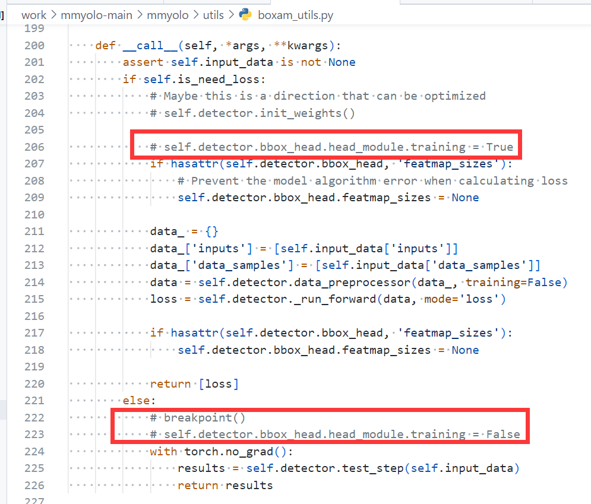

### 结果

```shell
The algorithm currently used is rtmdet
Loads checkpoint by local backend from path: /root/autodl-tmp/work/experiment/work_dirs/my_rtmdet_tiny_8xb32-300e_coco/best_coco_bbox_mAP_epoch_292.pth
[                                                  ] 0/1, elapsed: 0s, ETA:/root/miniconda3/envs/mmdet/lib/python3.8/site-packages/torch/functional.py:478: UserWarning: torch.meshgrid: in an upcoming release, it will be required to pass the indexing argument. (Triggered internally at  /opt/conda/conda-bld/pytorch_1659484810403/work/aten/src/ATen/native/TensorShape.cpp:2894.)
  return _VF.meshgrid(tensors, **kwargs)  # type: ignore[attr-defined]
[>>>>>>>>>>>>>>>>>>>>>>>>>>>>>>>>>>>>>>>>>>>>>>>>>>] 1/1, 0.4 task/s, elapsed: 3s, ETA:     0sAll done!
Results have been saved at /root/autodl-tmp/work/output
```

不再报错，boxAM特征图正常输出

